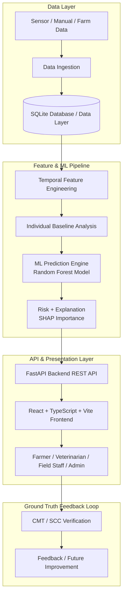

# MUNNOKKU

## AI-Assisted Early Forecasting of Bovine Mastitis

MUNNOKKU is an AI-assisted early-warning and decision-support platform designed for forecasting bovine mastitis risk in dairy cattle using longitudinal animal health signals and machine learning.

> [!IMPORTANT]
> **PROTOTYPE & SYNTHETIC DATA DISCLAIMER**
> MUNNOKKU is a research prototype evaluated on biologically structured synthetic longitudinal data. It is an AI-based decision-support system and **NEVER** claims clinical validation or real-farm accuracy. Predictions represent model-estimated future risk scores to support farmer and veterinary inspection—they do **NOT** constitute medical or veterinary diagnoses.

---

## Problem

Bovine mastitis is the single most costly disease affecting global and Indian dairy cattle. It negatively impacts animal health, milk production yield, milk quality, veterinary treatment expenses, and smallholder farmer profitability.

- **Subclinical Mastitis Challenge:** Early subclinical mastitis exhibits subtle physiological parameter changes (e.g., minor shifts in electrical conductivity, slight milk yield reduction, altered rumination) long before visible clinical symptoms (swelling, clots, fever) appear.
- **Economic Loss:** By the time clinical mastitis is visually observed, significant tissue damage and milk production loss have already occurred, requiring expensive antibiotic therapy or culling.
- **Need for Early Forecasting:** Providing a **7–14 day early warning** enables dairy farmers and field veterinarians to inspect and verify high-risk cows early using non-invasive California Mastitis Tests (CMT) or Somatic Cell Counts (SCC), preventing disease progression.

---

## Solution

MUNNOKKU addresses early mastitis management through an end-to-end longitudinal intelligence pipeline:

- **Longitudinal Animal Monitoring:** Continuously tracks daily multi-signal parameters for each cow over time.
- **Individual Baseline Comparison:** Establishes each animal's personal 14-day rolling physiological baseline, accounting for individual, breed, and lactation variance.
- **7–14 Day Future Risk Forecasting:** Predicts early subclinical mastitis risk up to 14 days before clinical manifestation.
- **Multi-Signal Convergence:** Evaluates joint shifts across milk electrical conductivity, daily yield, milk temperature, body temperature, rumination, and activity.
- **Explainable AI (SHAP):** Explains *why* an animal's risk is rising by extracting specific factor contributions (e.g., "+18.4% conductivity rise above baseline").
- **Farmer & Vet Decision Support:** Delivers clear, non-prescriptive recommendations ("Perform CMT verification") through a simple, multilingual mobile-first UI.

---

## Key Features

- 🔮 **7–14 Day Future Risk Forecasting:** Predictive lead-time window for early intervention.
- 🐄 **Individual Baseline Deviation Tracking:** Compares current signals against each cow's historical normal.
- 📊 **Multi-Signal Convergence Scoring:** Detects synchronized physiological shifts across multiple indicators.
- 💡 **Explainable AI (SHAP Factors):** Highlights top contributors driving risk probability.
- 📈 **Risk Trajectory & Trend Analysis:** Identifies whether risk is RISING, STABLE, or DECLINING.
- 🎯 **Data Confidence Score:** Independently measures data sufficiency (HIGH, MEDIUM, LOW, INSUFFICIENT).
- 🚨 **Actionable Farmer Alerts:** Immediate alerts for priority animals requiring attention today.
- 🧪 **CMT / SCC Verification Log:** Structured recording of ground truth test outcomes.
- 🩺 **Veterinarian Intelligence Module:** Deep clinical data access, SHAP feature breakdowns, and historical trends.
- 👷 **Field Staff Data Collection:** Practical logging form for daily milk yield, conductivity, and temperature.
- 🏢 **Farm Admin & Herd Intelligence:** Multi-farm summary stats, risk distributions, and GIS spatial placeholders.
- 🌐 **Multilingual Support:** Instant toggle between English (EN), Tamil (தமிழ்), and Hindi (हिंदी).
- 🔐 **Role-Based Access Control (RBAC):** Tailored interfaces for Farmer, Veterinarian, Field Staff, and Admin roles.
- 📱 **Mobile-First Responsive Interface:** Optimized for field use on 360px, 390px, and 412px touch devices.

---

## System Architecture



---

## Machine Learning Pipeline

1. **Preprocessing & Cleaning:** Cleans missing values, handles zero-yield entries, and sorts animal records chronologically.
2. **Temporal & Baseline Feature Engineering:**
   - Calculates 7-day and 14-day rolling averages and standard deviations per animal.
   - Computes percentage deviation from individual baseline ($\Delta_{EC}$, $\Delta_{Yield}$, $\Delta_{Rumination}$).
   - Derives 3-day and 7-day trend slopes and multi-signal convergence scores.
3. **Model Selection & Benchmarking:**
   - Evaluated models using strict chronological train/validation/test splits (zero data leakage).
   - **Random Forest Classifier** selected for optimal F1-score ($0.7500$) and PR-AUC ($0.7207$).
4. **Explainability Layer:**
   - Integrates SHAP (`TreeExplainer`) to transform complex model trees into human-readable feature descriptions for farmers and veterinarians.

---

## Prediction Target

For a clinically normal animal at time $t$, the prototype estimates future mastitis risk using information available up to time $t$ for a defined future window consistent with the **7–14 day early-warning objective**.

> [!NOTE]
> **Prediction ≠ Diagnosis**: The risk output represents an estimated probability of early subclinical mastitis development requiring verification. It does not replace clinical examination.

---

## Risk Level Categories

| Risk Level | Probability Threshold | Description / Model Category |
|---|---|---|
| **HIGH** | $\ge 70\%$ | High future risk probability. Immediate CMT/SCC verification recommended. |
| **MODERATE** | $45\% - 69\%$ | Moderate future risk probability. Close monitoring over 24–48 hours recommended. |
| **LOW** | $25\% - 44\%$ | Low risk shift detected. Maintain baseline observation. |
| **NO RISK** | $< 25\%$ | All signals within individual normal baseline parameters. |

---

## Technology Stack

| Category | Technology |
|---|---|
| **Frontend Framework** | React 19, TypeScript, Vite 8 |
| **Styling & UI** | Tailwind CSS v4, Lucide React (Icons), Recharts (Charts) |
| **Backend API** | FastAPI, Uvicorn (ASGI) |
| **Programming Language** | Python 3.14 / TypeScript |
| **Database** | SQLite 3 |
| **Machine Learning** | Scikit-Learn, Pandas, NumPy, Joblib |
| **Explainable AI** | SHAP (SHapley Additive exPlanations) |
| **Testing & Quality** | Pytest (Backend & ML), Oxlint, TypeScript Compiler (`tsc`) |

---

## Project Structure

```
SIH FINAL/
├── frontend/                   # React 19 + TypeScript + Vite + Tailwind UI
│   ├── src/
│   │   ├── components/         # AnimalCard, RiskGauge, MultiSignalCard, Navbar, BottomNavBar
│   │   ├── context/            # AuthContext (RBAC), LanguageContext (EN/TA/HI)
│   │   ├── pages/              # FarmerHome, AnimalDetail, AlertsPage, HerdIntelligence,
│   │   │                       # VerificationPage, ModelInfoPage, ProfilePage, RoleSelectionPage,
│   │   │                       # VeterinarianPlaceholder, FieldStaffPlaceholder, AdminPlaceholder
│   │   ├── services/           # API client with fallback handling (api.ts)
│   │   └── types.ts            # Core TypeScript interfaces
│   ├── package.json
│   └── vite.config.ts
│
├── backend/                    # FastAPI REST API Server
│   ├── app/
│   │   ├── api/routes.py       # API router & endpoint definitions
│   │   ├── schemas/schemas.py  # Pydantic data validation contracts
│   │   ├── services/           # Live ML prediction engine integration
│   │   ├── database.py         # SQLite connection manager
│   │   └── main.py             # FastAPI entrypoint & CORS middleware
│   ├── tests/test_api.py       # FastAPI Pytest suite
│   └── requirements.txt
│
├── ml/                         # Machine Learning Subsystem
│   ├── models/                 # Trained model binaries (best_model.pkl, feature_columns.pkl)
│   ├── tests/test_ml.py        # ML unit tests
│   ├── preprocessing.py        # Dataset cleaning & chronological splitting
│   ├── feature_engineering.py  # Rolling baseline & convergence features
│   ├── train.py                # Model training & benchmarking pipeline
│   ├── predict.py              # MastitisPredictionEngine service
│   ├── explain.py              # SHAP feature importance extraction
│   └── evaluate.py             # Classification & lead-time evaluation
│
├── database/                   # SQLite Database Layer
│   ├── schema.sql              # Relational schema definition
│   ├── seed.py                 # SQLite populator script
│   └── tunnokku.db             # Pre-seeded SQLite database
│
├── data/                       # Dataset Storage & Generator
│   ├── generate_dataset.py     # Biological synthetic dataset generator script
│   └── synthetic_mastitis_data.csv
│
├── .env.example                # Configuration template
├── .gitignore
└── README.md                   # Project documentation
```

---

## API Endpoints

| Method | Endpoint | Description / Purpose |
|---|---|---|
| `GET` | `/health` | API status, version, and synthetic dataset disclaimer. |
| `GET` | `/api/v1/auth/demo-users` | Returns list of seeded demo user accounts for RBAC. |
| `GET` | `/api/v1/animals` | List all animals with their latest ML risk prediction. |
| `GET` | `/api/v1/animals/{animal_id}` | Detailed animal profile with live ML risk forecast. |
| `GET` | `/api/v1/animals/{animal_id}/history` | 30-day chronological sensor telemetry series. |
| `GET` | `/api/v1/animals/{animal_id}/prediction` | Isolated ML prediction payload for specified animal. |
| `GET` | `/api/v1/alerts` | Active high-risk, moderate-risk, and rising-trend alerts. |
| `GET` | `/api/v1/herd/summary` | Aggregate herd risk distribution and priority attention list. |
| `POST` | `/api/v1/verification` | Log California Mastitis Test (CMT) or SCC verification record. |

---

## Roles & Access Control (RBAC)

- **FARMER (Demo Farmer):** Simple farmer-first mobile interface. View herd risk summary, check priority cows (e.g., COW-027), review "What Changed?", view "What Should I Do?", record CMT verification, and manage profile/language.
- **VETERINARIAN (Demo Veterinarian):** Clinical intelligence access. Inspect SHAP factor breakdowns, raw SCC/CMT history, individual baseline deviation charts, and clinical decision support.
- **FIELD_STAFF (Demo Field Staff):** Practical data collection form to log daily milk yield, electrical conductivity, temperature, and field notes.
- **ADMIN (Demo Admin):** Herd/farm-level analytics, multi-farm risk distribution, model version tracking, and GIS spatial mapping placeholder.

---

## Demonstration Flow (COW-027 Scenario)

1. **Role Selection:** Select **Farmer** on the landing page.
2. **Herd Summary:** View the top hero banner ("Do I need to check any animal today?") showing **COW-027** as requiring attention.
3. **Animal Inspection:** Click **"Check Animal"** on COW-027 (opens Animal Detail view).
4. **Future Risk Forecast:** Observe **84% model-estimated future risk** with **HIGH** risk level and **RISING** trend (7–14 day forecast horizon).
5. **What Changed?:** Review physiological baseline deviations:
   - Milk Conductivity: $\uparrow 18.4\%$ above baseline
   - Milk Yield: $\downarrow 24.2\%$ below baseline
   - Rumination & Activity: $\downarrow$ below baseline
6. **What Should I Do?:** Review recommendation: *"Perform California Mastitis Test (CMT) verification on all quarters immediately."*
7. **Record Verification:** Click **"RECORD VERIFICATION"** to log CMT score ($1+$) and confirm subclinical status.
8. **Switch Role:** Navigate to **Profile** $\rightarrow$ click **"Switch Demo Role"** $\rightarrow$ select **Veterinarian**.
9. **Veterinarian Intelligence:** Inspect clinical SHAP feature contributions, SCC trends, and historical verification logs.

---

## Installation & Setup

### Prerequisites
- Python 3.10+ (tested on Python 3.14)
- Node.js 18+ and npm

### 1. Clone & Set Up Environment
```bash
git clone <repository-url>
cd SIH-FINAL
```

### 2. Backend & Machine Learning Setup
```bash
# Create virtual environment (optional)
python -m venv venv
# On Windows:
venv\Scripts\activate
# On Linux/macOS:
source venv/bin/activate

# Install Python dependencies
pip install -r backend/requirements.txt

# Seed local SQLite database
python database/seed.py

# Run FastAPI Backend Server
python -m uvicorn backend.app.main:app --host 0.0.0.0 --port 8000 --reload
```

### 3. Frontend Setup
```bash
# In a new terminal window
cd frontend
npm install
npm run dev
```
Open `http://localhost:5173` in your browser.

---

## Environment Variables

Copy `.env.example` to `.env` if customization is needed:

```ini
# Backend API Configuration
PORT=8000
HOST=0.0.0.0
DB_PATH=database/munnokku.db
ALLOWED_ORIGINS=*

# Frontend Configuration
VITE_API_BASE_URL=http://localhost:8000
VITE_USE_MOCK_API=false

# Security & Secrets
SECRET_KEY=change_this_to_a_secure_random_string_in_production
```

---

## Verification & Testing

### Run Backend API Unit Tests
```bash
python -m pytest backend/
```

### Run Machine Learning Unit Tests
```bash
python -m pytest ml/
```

### Run Frontend Typecheck & Build
```bash
cd frontend
npm run lint
npm run build
```

---

## Deployment Architecture

- **Frontend:** Built via `vite build` to static HTML/JS/CSS assets. Ready for deployment on Vercel, Netlify, Cloudflare Pages, or AWS S3/CloudFront.
- **Backend API:** Containerizable FastAPI application runnable via Gunicorn/Uvicorn on Render, Railway, Fly.io, or AWS EC2/ECS.
- **Database:** SQLite file-based database for prototype demonstration, migratable to PostgreSQL for production cloud deployment.

---

## Project Limitations

- **Synthetic Data:** System evaluation was performed on biologically modeled synthetic longitudinal data. Real-farm clinical validation is required.
- **Decision Support Only:** Predictions provide early risk signals for inspection and do not constitute veterinary medical diagnosis.
- **Sensor Integration:** Prototype assumes available sensor telemetry; physical IoT hardware integration is a future deployment step.
- **Field Features:** Automated SMS notifications, WhatsApp alerts, and GIS spatial mapping are prototype placeholders.

---

## Future Work

- 🐄 Validation on live dairy farm herds across diverse Indian breeds (Gir, Sahiwal, Crossbreds).
- 📡 Direct IoT hardware integration with inline automated milking sensors.
- 📱 Offline-first PWA with SMS/WhatsApp alert dispatch for rural farmers.
- 🗺️ GIS spatial cluster surveillance for regional cooperative disease tracking.

---

## Team

**TEAM MUNNOKKU**

---

## Responsible AI & Data Note

This prototype utilizes synthetic data generated for development and demonstration purposes. MUNNOKKU is not a veterinary diagnostic system. All model risk predictions require appropriate field verification (CMT/SCC) and qualified veterinary judgment.
